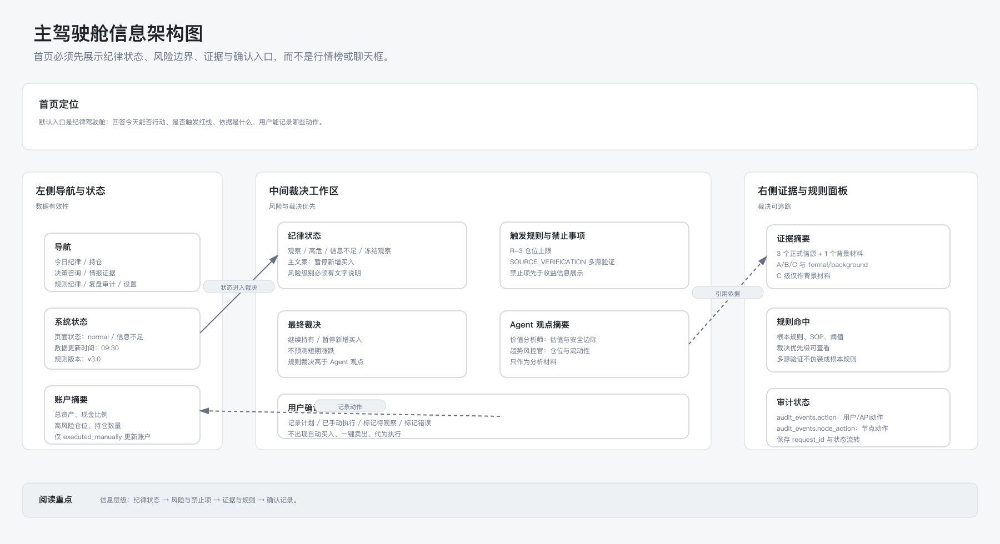
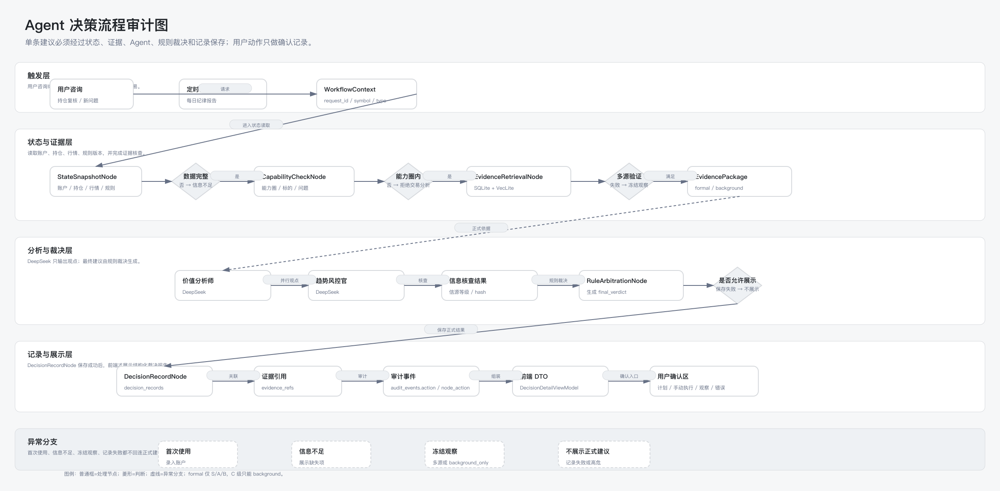
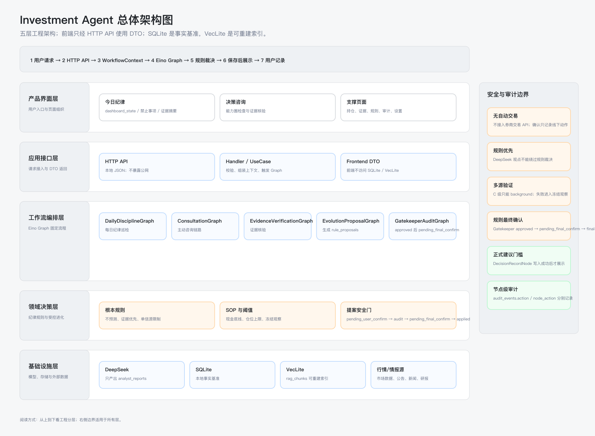

# Investment Agent

[English](README.md) | [简体中文](README.zh-CN.md)

Investment Agent 是一个本地优先的个人投资纪律工作台，用于辅助个人研究、组合维护、证据复核和人工决策治理。它把公开证据采集、本地 SQLite 状态、VecLite 检索、确定性规则和可配置的 LLM 分析串成一条可审计流程，但最终动作始终由用户手动决定。



## 项目功能

| 模块 | 作用 |
| --- | --- |
| 每日纪律工作台 | 展示今日状态、待处理人工动作、风险信号、通知和复盘事项。 |
| 组合维护 | 记录本地账户校准、持仓、现金/货币基金桶、买入日期、观察状态和人工修正。 |
| 证据复核 | 采集并索引受支持的公开证据、本地知识、市场快照和数据源健康记录。 |
| 决策咨询 | 在证据充分时运行受治理的分析流程，包含规则检查、RAG 上下文、预期收益检查和可配置的 LLM 分析材料。 |
| 人工确认 | 记录用户显式确认或拒绝的最终决策，并写入本地审计轨迹，不下单。 |
| 复盘与治理 | 支持月度/季度复盘、错误标注、规则提案、守门人检查和发布验收证据追溯。 |
| 本地运维 | 提供配置、诊断、数据质量、备份/恢复、安装/升级/卸载相关的本地运维入口和文档。 |

## 安全边界

Investment Agent 是研究和决策支持系统，不是交易系统。它不连接券商，不自动交易，不提供一键交易，不代下单，不发送外部推送，不自动确认决策，不自动应用规则变更，不承诺收益，不依赖付费/登录/授权专属市场数据，不使用 Level2 行情，也不做高频数据采集。

## 产品流程



1. 维护本地组合、账户和持仓事实。
2. 刷新受支持的公开数据和本地证据。
3. 检查数据源健康、风险预警和证据准备度。
4. 在证据充分时发起决策咨询。
5. 阅读分析材料、规则检查、假设、证据和审计轨迹。
6. 由用户手动确认或拒绝，系统只在本地记录结果。
7. 通过复盘和治理页面追踪结果、错误、规则提案和后续改进。

## 架构概览



应用由本地 Go + SQLite + VecLite 后端和 React/Vite 前端组成。Docker Compose 是在个人电脑、NAS 或 VPS 上运行的推荐方式，数据目录和密钥由用户自己控制。更多实现细节见 [docs/architecture.md](docs/architecture.md)；README 只保留高层产品说明。

## 快速开始

```bash
cp .env.example .env
# 如需真实 LLM 分析，在 .env 中配置 DEEPSEEK_API_KEY 或兼容配置。
bash scripts/install.sh
```

打开安装脚本输出的地址，通常是：

```text
http://127.0.0.1:4173
```

默认 Docker Compose 端口只绑定 `127.0.0.1`。安装、升级、卸载、健康检查和排障见 [docs/quickstart.md](docs/quickstart.md)，发布部署契约见 [docs/deployment.md](docs/deployment.md)。

## 文档入口

| 文档 | 用途 |
| --- | --- |
| [产品概览](docs/product-overview.md) | 用户工作流、核心概念和产品安全边界。 |
| [快速开始](docs/quickstart.md) | Docker Compose 安装、本地配置、启动、升级、卸载、健康检查和排障。 |
| [文档地图](docs/README.md) | 产品、架构、API、运维、治理和发布证据的索引。 |
| [需求真源](docs/requirements.md) | L1 产品需求契约。 |
| [API 契约](docs/api.md) | HTTP API 契约。 |
| [前端契约](docs/frontend-contract.md) | 前端路由与交互契约。 |
| [发布材料](docs/release/README.md) | 验收记录、风险边界和发布证据。 |
| [发布历史](docs/release/history.md) | 历史阶段、验收结论和发布 caveat。 |

## CI 与发布状态

仓库包含 GitHub Actions 门禁，覆盖 OpenSpec 校验、Go vet/tests、受限 Go lint、前端 lint/test/build、部署检查、P92/P93 审计检查、发布包 smoke、空白字符检查和安全扫描。tag workflow 会在预检通过后生成本地部署包。这些门禁不代表产品具备交易能力，也不会改变上面的安全边界。

## 治理规则

权威文档位于 `docs/`。行为、API、数据模型、工作流或前端契约级变更需要通过 OpenSpec change 包，并在归档时合并回 `docs/`。修改前请阅读 [docs/GOVERNANCE.md](docs/GOVERNANCE.md) 和 [openspec/project.md](openspec/project.md)。
