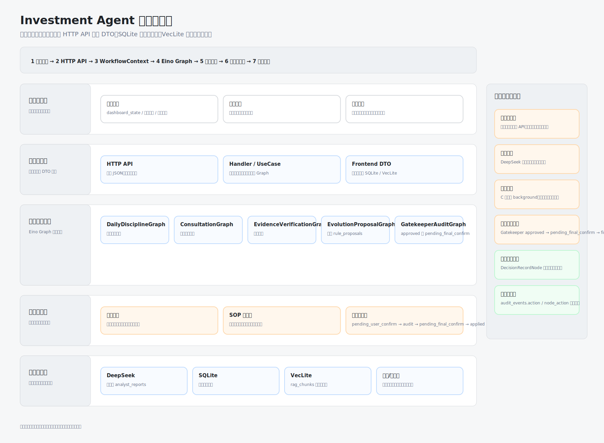
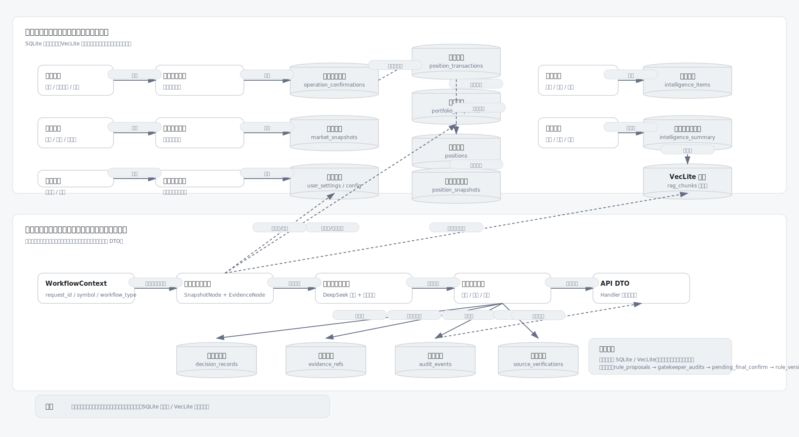

# Investment Agent 项目架构与技术规范

> 基线版本：v3.0  
> 最后更新：2026-06-23
> 定位：个人 AI 投资纪律 Agent，遵循投资大师智慧，严格执行预设规则，支持多 Agent 辩论、预期收益评估、信源分级防伪与安全自主学习。  
> 配套文档：Eino 工作流见 `docs/workflow.md`，HTTP API 契约见 `docs/api.md`，前端数据契约见 `docs/frontend-contract.md`。

## 1. 系统设计哲学

| 信念 | 说明 |
| --- | --- |
| 不预测，只应对 | Agent 不预测涨跌，只基于当前状态和预设纪律做出反应。 |
| 纪律优先 | 朴素纪律严格执行，优先于复杂策略分析。 |
| 可解释 | 每条建议都必须能追溯到具体数据、规则和推理路径。 |
| 白箱化 | 所有逻辑对用户透明，可审计、可修改、可进化。 |
| 概率思维 | 输出置信区间和情景概率，避免绝对判断。 |
| 受控进化 | 系统可以学习，但规则修改必须经过人工确认和安全审计。 |

## 2. 技术栈总览

### 2.1 总体架构图



说明：需求文档中的四层结构是产品能力视角；上图采用五层工程实现视角，用于表达前端、应用接口、Eino 工作流、领域规则和基础设施之间的依赖关系。

### 2.2 数据与存储关系图



说明：上图用于表达外部数据如何写入本地事实库，以及 Eino 工作流如何读取 SQLite 与 VecLite 并生成前端 DTO。SQLite 是账户、持仓、情报摘要、决策记录和审计事件的事实基准；VecLite 是由 SQLite 情报摘要重建的辅助检索索引，不作为唯一事实来源。前端只能通过 HTTP API 使用 DTO，不直接访问 SQLite、VecLite 或本地文件。

### 2.3 技术选型

| 类别 | 技术选型 | 说明 |
| --- | --- | --- |
| 语言 | Go 1.22+ | 高性能、强类型、并发支持好。 |
| Agent 编排 | Eino | 从第一版起使用完整组件化与 Graph 编排，避免后续架构迁移。 |
| 大模型 | DeepSeek | 项目固定主模型，降低模型适配复杂度。 |
| 嵌入模型 | text-embedding-3-small / bge-large-zh | 文本向量化，兼顾中文语义效果。 |
| 向量数据库 | VecLite | 纯 Go 嵌入式向量库，提供 HNSW、BM25、混合检索、metadata 过滤和单文件存储。 |
| 关系数据库 | SQLite 本地版 | 统一存储账户、行情、错误案例、情报摘要和操作日志。 |
| 数据库迁移 | GORM AutoMigrate + 手写 SQL | 开发期快速迭代，稳定后精确管理。 |
| 配置 | YAML + 环境变量 | 轻量，减少额外框架依赖。 |
| 依赖注入 | main.go 手动注入 | 显式、易调试、无隐式魔法。 |
| HTTP | net/http + pkg/httputil | 轻量 HTTP 服务与客户端封装。 |
| 前端 | React + Vite + TypeScript | 构建本地 Web 控制台，主窗口为 Agent 决策驾驶舱。 |
| 图表 | ECharts | 展示账户快照、仓位比例、估值分位和复盘图表。 |
| 日志 | pkg/logger | 统一格式和日志级别。 |
| 测试 | Go testing + 分层测试 | 领域层单测覆盖率目标大于 90%。 |

## 3. 项目目录结构

```text
investment-agent/
├── cmd/
│   ├── agent/        # 本地任务 CLI：数据刷新、smoke、质量门禁
│   ├── server/       # 本地 HTTP API 服务
│   └── smoke-seed/   # E2E/恢复演练 seed 工具
├── internal/
│   ├── application/
│   │   ├── dto/      # HTTP/API 展示 DTO
│   │   ├── handler/  # net/http handler 与统一响应信封
│   │   ├── knowledge/# 内置大师经验与标的画像注册表
│   │   ├── service/  # 应用服务：组合、确认、证据、设置、规则治理等
│   │   └── workflow/ # Eino 图、节点步骤、数据源 collector、RAG/预期收益
│   ├── domain/
│   │   ├── analyst/  # 分析师端口定义
│   │   ├── model/    # 核心实体和值对象
│   │   ├── repository/# 仓储接口和事务协调接口
│   │   └── rule/     # 纯规则、信源、风险、能力圈、守门人逻辑
│   └── infrastructure/
│       ├── config/   # YAML + env + secret-file runtime config
│       ├── llm/deepseek/
│       ├── persistence/sqlite/
│       │   └── migration/
│       └── wiring/   # 生产依赖组装
├── scripts/          # 本地安装、发布包、验收和工程门禁脚本
├── pkg/
│   ├── httputil/
│   └── logger/
├── web/
│   ├── src/
│   │   ├── app/
│   │   ├── pages/
│   │   ├── components/
│   │   ├── features/
│   │   ├── services/
│   │   ├── styles/
│   │   ├── shared/
│   │   ├── styles/
│   │   └── types/
├── configs/
├── docs/
├── openspec/
├── go.mod
└── go.sum
```

## 4. 核心模块职责

| 层级 | 目录 | 职责 | 依赖方向 |
| --- | --- | --- | --- |
| 领域层 | `internal/domain/model/` | 定义核心实体、值对象、状态枚举和审计动作。 | 不依赖其他业务模块。 |
| 领域层 | `internal/domain/repository/` | 定义仓储接口。 | 仅依赖 model。 |
| 领域层 | `internal/domain/rule/` | 纯函数规则引擎，包括规则计算、辩论裁决、预期收益、守门人纯逻辑。 | 仅依赖 model。 |
| 领域层 | `internal/domain/analyst/` | 定义分析师输出端口和模型无关结构。 | 可依赖 model。 |
| 应用层 | `internal/application/workflow/` | Eino 图、工作流上下文、数据源 collector、证据/RAG、预期收益和裁决编排。 | 依赖 repository 接口、domain model/rule 和注入端口。 |
| 应用层 | `internal/application/service/` | 组合维护、确认、证据、设置、风险、规则治理、查询和知识准备度服务。 | 依赖 repository 接口和领域规则，不直接持有具体 SQLite 类型。 |
| 应用层 | `internal/application/handler/` | 请求解析、DTO 映射、统一响应和路由注册。 | 调用应用服务或工作流入口，不拼接 SQL。 |
| 基础设施 | `internal/infrastructure/persistence/sqlite/` | SQLite schema migration、仓储实现和事务协调。 | 实现 repository 接口；打开连接时设置本地运行 PRAGMA。 |
| 基础设施 | `internal/infrastructure/llm/deepseek/` | DeepSeek 兼容 Chat Completions 客户端。 | 由 wiring 注入到工作流分析师端口。 |
| 基础设施 | `internal/infrastructure/config/` | YAML、环境变量和 secret-file 配置加载与校验。 | 被 cmd 和 wiring 调用。 |
| 基础设施 | `internal/infrastructure/wiring/` | 按配置组装数据源、LLM、VecLite 和工作流依赖。 | 位于 cmd 与应用层之间。 |
| 公共基础能力 | `internal/pkg/` | 与业务规则解耦但需要被应用层和基础设施层共享的能力，包括统一应用错误、ID 生成和时间格式化。 | 可被 application、infrastructure、pkg/http 使用。 |
| 公共库 | `pkg/` | 与业务无关的通用能力，例如 HTTP 信封、客户端和日志。 | 可被各层调用。 |
| 前端 | `web/` | Agent 决策驾驶舱和支撑页面。 | 通过 HTTP API 调用后端，不访问本地数据库和文件。 |
| 工程门禁 | `scripts/go-packages.sh`、`scripts/api_route_contract_check.py`、`scripts/p93_code_reality_audit.py` | 后端包选择、API 路由契约和代码真实性审计。 | 被 CI、release workflow 和本地验收调用。 |

## 5. 分层依赖规则

1. `domain/model` 零业务依赖，只定义实体、值对象和常量。
2. `domain/repository` 仅依赖 `domain/model`。
3. `domain/rule` 仅依赖 `domain/model`，保持纯逻辑和无副作用。
4. `domain/services` 可依赖 `domain/model` 和 `domain/repository` 接口，不依赖具体实现。
5. `application` 依赖 repository 接口、services 接口和 rule，不依赖基础设施具体实现。
6. `infrastructure` 实现 domain 中定义的接口，并封装外部技术；禁止反向依赖 application 或 domain/rule。
7. `pkg` 不包含业务逻辑，可被各层安全调用。
8. `cmd/main.go` 负责组装依赖并完成手动注入。
9. `internal/application/workflow` 只依赖 `domain/repository` 中的仓储接口和事务协调接口，不导入 SQLite 具体实现。
10. `internal/application/handler` 只负责请求解析、调用应用服务或工作流入口、写响应信封；不得直接持有数据库连接、拼接 SQL 或管理 SQL 事务。
11. 后端 Go 验证必须通过 `scripts/go-packages.sh` 选择项目自有包，避免 `web/node_modules` 或其他前端依赖目录进入 Go package discovery。
12. HTTP API 路由必须通过 `scripts/api_route_contract_check.py` 与 `docs/api.md` / `docs/frontend-contract.md` 保持同步。
13. P93 代码真实性审计扫描 Git tracked 与 nonignored untracked 的 release-relevant source files，不以 ignored 本地运行产物作为审计输入。
14. SQLite 本地文件库连接启用 foreign keys、busy timeout，并尝试 WAL；`:memory:` 测试库保持兼容。

### 5.1 工程门禁与本地运行约束

| 约束 | 说明 |
| --- | --- |
| 后端包选择 | CI、release 和本地后端测试使用 `go test $(bash scripts/go-packages.sh)`，不得裸用 `go test ./...` 作为公开仓库门禁。 |
| API 契约同步 | 新增或删除 `/api/v1` 路由时，必须同步 API 文档并通过 `python3 scripts/api_route_contract_check.py`。 |
| 代码真实性审计 | `python3 scripts/p93_code_reality_audit.py --check` 是 release 边界、secret 和 demo/stub 风险门禁；本地 ignored runtime artifacts 不应改变结果。 |
| SQLite 并发 | 本地产品以单用户低并发为目标，但 UI、每日自动运行和刷新任务可能并发访问 SQLite，因此文件库使用 WAL/busy timeout 降低锁冲突。 |
| Docker secrets | `.env` 是简易路径；`DEEPSEEK_API_KEY_FILE` 支持本地 secret-file/Compose override 方式。运行时密钥不得提交。 |

## 6. 关键设计决策

### 6.1 领域层命名调整

- 原 `domain_service` 调整为 `domain/rule`，专指纯函数规则引擎。
- 原 `domain/service` 接口调整为 `domain/services/`，与 `repository` 平级，表示领域服务端口。
- 规则逻辑和服务接口分离，减少命名混淆，便于测试与审计。

### 6.2 多 Agent 辩论机制

决策流程：

1. 信息核查：RAG 与防伪模块提供已验证情报。
2. 价值分析师：`infrastructure/analyst/value_analyst.go` 调用 LLM，注入格雷厄姆、巴菲特、邓普顿思维框架，生成独立分析报告。
3. 趋势风控官：`infrastructure/analyst/trend_officer.go` 调用 LLM，注入利弗莫尔、达利欧、马克斯思维框架，生成独立分析报告。
4. 裁决机制：`domain/rule/rules_engine.go` 基于根本规则优先级，对两份报告的论点进行规则裁决，输出灰度建议。

### 6.3 领域服务接口化

- `domain/services/gatekeeper.go` 定义 `GatekeeperService` 接口。
- `domain/services/analyst.go` 定义 `ValueAnalystService` 和 `TrendOfficerService` 接口，应用层只依赖分析师端口。
- `Audit` 方法可通过 `MarketRepository` 获取历史数据，支持规则回测。
- 合规检查、样本数量检查、规则冲突检查等纯逻辑保留在 `domain/rule/gatekeeper_logic.go`。
- 需要外部数据或历史回测的实现放在基础设施层或应用装配层，并通过接口注入。

### 6.4 账户状态统一使用 SQLite

- 用户确认操作后，系统更新 SQLite 中的账户、持仓和操作记录。
- 账户状态来源固定为 SQLite，本地文件不得作为主账户状态来源。
- 每次决策均读取用户确认后的 SQLite 快照。
- 操作确认记录需保留成交数量、成交价格、确认时间、关联建议编号。

### 6.5 向量存储固定使用 VecLite

- 向量存储采用 VecLite，作为项目确定性基础设施。
- VecLite 以 Go 嵌入式方式集成，不依赖独立向量数据库服务。
- 文本摘要向量、BM25 索引、metadata 过滤条件均由 `infrastructure/rag/vector_store.go` 统一封装。
- 向量文件默认存储在 `./data/investment.vec`，与 SQLite 数据文件一起纳入本地备份策略。
- SQLite 中的情报摘要是事实基准，VecLite 索引可由 SQLite 摘要表重建。
- 若 VecLite 文件损坏或索引版本不兼容，系统应清理向量文件并从 SQLite 重新构建索引。
- 备份与迁移必须同时包含 SQLite 数据文件和 VecLite 向量文件。

## 7. RAG 模块架构

### 7.1 处理流程

1. 定时爬取：`news/crawler.go` 从 S/A/B 级信源获取资讯。
2. 大模型打标：`news/classifier.go` 提取实体、事件、影响方向、可信度等级、发布时间。
3. 向量化：`rag/embedder.go` 将文本摘要转为向量。
4. 双库存储：结构化小结写入 SQLite，文本摘要向量写入 VecLite。
5. 决策检索：`rag/retriever.go` 优先查询结构化小结，需要详细分析时回溯原文。
6. 重排序：结合语义匹配、信源等级和时效权重，返回 Top-K 证据。

### 7.2 信源分级标准

| 等级 | 定义 | 示例 | 用途 |
| --- | --- | --- | --- |
| S 级 | 官方公告，具有法律效力。 | 交易所公告、证监会文件。 | 最终事实基准。 |
| A 级 | 指定信息披露媒体、公司正式公告。 | 巨潮资讯、四大证券报。 | 交叉验证主要依据。 |
| B 级 | 知名券商研报、头部财经媒体。 | 中金、中信研报、财新。 | 参考分析视角。 |
| C 级 | 未经证实的小道消息。 | 股吧、微信群、自媒体。 | 只能作为 `background` 背景材料，不得作为正式裁决依据。 |

### 7.3 信源时效权重与重排序

`infrastructure/rag/retriever.go` 检索后执行重排序：

```text
时效性得分：
- 0-24 小时：1.0
- 1-7 天：0.8
- 7-30 天：0.5
- 30 天以上：0.2，仅作背景

信源权重：S = 1.0，A = 0.9，B = 0.7
最终得分 = 语义相关度 × 时效性得分 × 信源权重
```

处理规则：

- C 级信源默认不进入决策检索结果。
- 最终得分低于 `0.5` 的文档默认过滤，但 S/A 级重大公告可保留为背景证据。
- 返回 Top-K 时必须携带原始来源、信源等级、发布时间、最终得分。
- 涉及重大逻辑变化的内容，仍需满足多源验证规则。

## 8. 配置设计

配置文件建议使用 `config.yaml`，敏感字段通过环境变量注入。

```yaml
server:
  port: 8080

database:
  driver: sqlite
  dsn: ./data/investment.db

llm:
  provider: deepseek
  api_key: ${LLM_API_KEY}
  base_url: https://api.deepseek.com

rag:
  vector_store: veclite
  veclite_path: ./data/investment.vec
  rerank_min_score: 0.5
  top_k: 8

news:
  sources:
    - name: cninfo
      level: A
      url: https://www.cninfo.com.cn
    - name: exchange
      level: S
      url: https://www.sse.com.cn

strategy:
  high_risk_max_ratio: 0.20
  min_cash_ratio: 0.05
  pe_danger_zone: 80.0
  pe_comfort_zone: 30.0
```

### 8.1 配置项说明

| 配置项 | 说明 | 默认值 |
| --- | --- | --- |
| `server.port` | HTTP 服务端口。 | `8080` |
| `database.driver` | 数据库驱动。 | `sqlite` |
| `database.dsn` | 数据库连接串。 | `./data/investment.db` |
| `llm.provider` | 大模型提供商，固定为 deepseek。 | `deepseek` |
| `llm.api_key` | API 密钥，支持环境变量。 | `${LLM_API_KEY}` |
| `llm.base_url` | API 地址。 | DeepSeek API 地址 |
| `rag.vector_store` | 向量库类型，固定使用 VecLite。 | `veclite` |
| `rag.veclite_path` | VecLite 单文件存储路径。 | `./data/investment.vec` |
| `rag.rerank_min_score` | 重排序过滤阈值。 | `0.5` |
| `rag.top_k` | 检索返回数量。 | `8` |
| `news.sources` | 新闻信源列表。 | 空列表 |
| `strategy.high_risk_max_ratio` | 高风险资产仓位上限。 | `0.20` |
| `strategy.min_cash_ratio` | 最低现金比例。 | `0.05` |
| `strategy.pe_danger_zone` | PE 高危区阈值。 | `80.0` |
| `strategy.pe_comfort_zone` | PE 舒适区阈值。 | `30.0` |

## 9. Eino Graph 与 HTTP API 规范

### 9.1 Eino Graph 装配位置

Eino Graph 在 `cmd/agent/main.go` 和 `cmd/server/main.go` 中完成装配，并通过应用层 handler 触发执行。Graph 节点定义和执行顺序以 `docs/workflow.md` 为准。

装配规则：

- `cmd/agent` 用于每日纪律报告、情报刷新、周期复盘等定时工作流。
- `cmd/server` 用于驾驶舱刷新、决策咨询、用户确认、规则提案审批等交互工作流。
- Graph 节点不得直接访问前端 DTO。
- Graph 节点输出必须写入应用层 DTO，再由 HTTP API 返回前端。
- 每次 Graph 执行必须生成 `request_id` 和审计事件。

### 9.2 Graph 节点接口约束

所有节点必须遵守统一上下文约束：

- 输入来自 `WorkflowContext`。
- 输出只能追加或更新当前节点负责的字段。
- 节点错误必须转成标准错误码，不得直接暴露底层错误。
- 规则裁决必须由 `domain/rule` 完成。
- LLM 节点只生成分析材料，不生成最终裁决。

### 9.3 HTTP API 边界

HTTP API 由 `cmd/server` 提供，契约以 `docs/api.md` 为准。

边界规则：

- API 统一使用 `/api/v1` 前缀。
- API 默认监听 `127.0.0.1:8080`。
- API 只服务本地 Web 控制台，不默认暴露公网。
- API 不提供买入、卖出、撤单、改单接口。
- 用户确认接口只记录用户在线下已完成的操作或计划。
- 所有响应必须包含 `request_id`。

### 9.4 错误码规范

统一错误体系由 `internal/pkg/apperr` 承载。业务错误、仓储错误和工作流错误必须转换为稳定 `code` 与 `category`，HTTP 层只能通过错误映射生成响应信封，前端不得解析底层错误文本。

| 错误码 | 场景 | 处理 | HTTP |
| --- | --- | --- | --- |
| BAD_REQUEST | 请求参数或状态流转不合法 | 展示字段或操作错误 | 400 |
| NOT_FOUND | 资源不存在 | 展示空状态 | 404 |
| CONFLICT | 唯一约束或事实状态冲突 | 展示冲突或阻塞状态 | 409 |
| INVALID_STATE | 非法状态流转 | 阻止本次操作 | 409 |
| DATA_REQUIRED | 缺少账户或持仓 | 引导用户录入 | 409 |
| DATA_STALE | 行情或估值过期 | 暂停交易类建议 | 409 |
| EVIDENCE_NOT_FOUND | 未找到有效证据 | 展示信息不足状态，暂停交易类建议 | 409 |
| SOURCE_VERIFICATION_FAILED | 多源验证不满足 | 进入冻结观察 | 409 |
| VECTOR_INDEX_UNAVAILABLE | VecLite 索引不可用 | SQLite 摘要充足时降级展示；摘要不足时展示信息不足状态 | 409 |
| ANALYST_UNAVAILABLE | LLM 分析节点不可用 | 使用规则裁决降级输出 | 409 |
| RULE_VERSION_MISSING | 规则版本缺失 | 暂停裁决 | 409 |
| DECISION_RECORD_FAILED | 决策记录保存失败 | 不展示正式建议 | 409 |
| INTERNAL_ERROR | 未分类内部错误 | 展示通用失败状态 | 500 |

### 9.5 基础治理能力

基础治理位于 P3 与 P4 之间，目的是让 HTTP API 之前的工作流、仓储和前端契约使用同一套基础规则。

| 能力 | 位置 | 约束 |
| --- | --- | --- |
| 统一错误 | `internal/pkg/apperr`、`pkg/httputil`、workflow error code | 错误必须可映射到 HTTP status、审计 `error_code` 和前端展示状态。 |
| 统一 ID | `internal/pkg/idgen` | 工作流生成的决策、证据引用、审计、规则应用等 ID 通过集中函数生成。 |
| 统一时间 | `internal/pkg/clock` | 默认使用 UTC，持久化和审计时间使用 RFC3339；测试可使用固定时钟。 |
| 事务边界 | repository 接口和 SQLite 实现 | 同一事实单元及其相关审计事件必须通过统一事务协调路径原子提交；失败时回滚该事务内所有事实。 |
| 审计契约 | `AuditFragment`、`AuditWriter`、`audit_events` | 节点完成、降级或失败都必须有 action、node_name、node_action、输入引用；失败和降级必须有错误码。 |
| 测试策略 | Go 单测、前端类型契约、构建验证 | 基础包、事务、工作流分支、API 错误信封和前端错误状态都必须可验证。 |

基础治理能力贯穿 HTTP、workflow、domain repository 和 infrastructure：HTTP 只消费统一错误和信封；workflow 只生成统一错误码、ID 和审计片段；repository 定义事务单元并分类错误；infrastructure 负责把 SQLite 原始错误转换为应用错误。

## 10. 前端架构规范

### 10.1 前端定位

前端固定采用 React + Vite + TypeScript，实现本地 Web 控制台。主窗口为 Agent 决策驾驶舱，其他页面为数据管理、证据、规则和审计支撑页面。

### 10.2 前端目录职责

| 目录 | 职责 |
| --- | --- |
| `web/src/app/` | 应用入口、路由、全局布局、错误边界。 |
| `web/src/pages/` | 路由级组合组件，只组合 feature 模块、布局和页面级加载/错误状态；不得承载大段业务逻辑、DTO 映射或 API 细节。 |
| `web/src/components/` | 无业务含义的通用 UI 组件。 |
| `web/src/features/` | 按 dashboard、decision、evidence、portfolio、rules、audit、settings、market、review 等业务域组织页面组件、DTO mapper 和 feature API 入口。 |
| `web/src/shared/` | 跨 feature 复用的 API client、类型、工具和通用组件。 |
| `web/src/services/` | 兼容旧入口或薄 re-export；新增共享 API 能力优先放入 `web/src/shared/api/`。 |
| `web/src/styles/` | 设计 token、主题、全局样式。 |
| `web/src/utils/` | 日期、金额、比例、状态文案等前端工具函数。 |

### 10.3 前端依赖规则

- 前端不得直接访问 SQLite、VecLite 或本地文件。
- 前端只通过后端 HTTP API 获取数据和提交用户确认结果。
- 页面组件可以依赖 `features`、`components`、`services`。
- `pages` 只做路由组合、布局、加载和错误状态编排，不直接承载业务 DTO 映射、复杂状态机或 API 细节。
- `components` 不得依赖业务 API。
- `features` 可以组合业务数据和通用组件；dashboard、decision、evidence、portfolio、rules、audit、settings、market、review 等业务 UI 应分别放在对应 feature 目录。
- 跨 feature 复用的 API client、类型、工具和通用组件放在 `web/src/shared/`。
- 所有用户可见状态必须转成可理解文案，不直接展示技术字段作为主信息。
- 前端不得出现自动交易入口。

### 10.4 前端测试要求

- 关键业务组件需覆盖渲染测试。
- 裁决报告、证据链、操作确认区必须有交互测试。
- 金额、比例、日期、状态文案格式化函数必须有单元测试。

## 11. 开发规范

### 11.1 代码风格

- Go 版本最低为 Go 1.22。
- 格式化使用 `gofmt` 或 `goimports`。
- 包名使用小写、单数、简洁命名，例如 `model`。
- 接口名使用名词或动词短语，例如 `PortfolioRepository`、`DecisionService`。
- 文件名使用蛇形命名，例如 `rules_engine.go`。
- 测试文件命名为 `xxx_test.go`，与源文件同目录。

### 11.2 分层开发规范

#### `domain/model/`

- 只能定义结构体、常量、值对象。
- 禁止包含数据库标签，例如 `gorm:"column:xxx"`。
- 禁止依赖外部基础设施包。

#### `domain/repository/`

- 只能定义接口。
- 方法签名只使用 `domain/model` 类型。
- 禁止包含接口实现。

#### `domain/rule/`

- 只能包含纯逻辑函数。
- 输入输出只使用 `domain/model` 类型。
- 禁止网络调用、数据库操作、文件读写。

#### `domain/services/`

- 只能定义领域服务接口。
- 可依赖 `domain/model` 和 repository 接口。
- 分析师能力必须通过 `AnalystService` 类接口暴露给应用层。
- 禁止依赖基础设施实现。

#### `application/handler/`

- 只做用例编排。
- 调用 repository 接口、services 接口和 `domain/rule`。
- 禁止操作数据库驱动或 HTTP 客户端。

#### `infrastructure/`

- 实现 domain 中定义的接口。
- 可以依赖外部技术。
- 禁止反向依赖 application 或 domain/rule。

### 11.3 错误处理规范

- 使用 `internal/pkg/apperr` 表达业务、工作流和仓储错误。
- 禁止缺少上下文的裸错误返回；仓储层必须把 `sql.ErrNoRows`、唯一约束、非法状态流转等错误转换为可分类应用错误。
- 外部依赖失败必须保留原始 cause，但 HTTP 响应不得暴露 SQL、文件路径或外部服务原始错误。
- 应用层错误使用预定义错误码，并能映射到 HTTP status、审计 `error_code` 和前端展示状态。

示例：

```go
return apperr.Wrap(apperr.CodeConflict, apperr.CategoryConflict, "constraint conflict", err)
```

### 11.4 日志规范

- 统一使用 `pkg/logger`。
- 禁止使用 `fmt.Println` 输出业务日志。
- 日志需携带可追溯上下文，例如 request_id、portfolio_id、symbol、source_level。

| 级别 | 使用场景 |
| --- | --- |
| Debug | 开发调试信息。 |
| Info | 关键业务流程节点。 |
| Warn | 触发纪律预警、数据质量不足。 |
| Error | 外部依赖失败、不可恢复错误。 |

### 11.5 依赖注入规范

- 依赖注入集中在 `cmd/agent/main.go` 或 `cmd/server/main.go`。
- 初始化顺序：配置、日志、数据库、外部客户端、仓储、Eino 图、应用处理器、入口服务。
- 禁止在 `internal/` 内使用全局变量或 `init()` 完成隐式注入。

### 11.6 测试规范

- 基础包必须覆盖错误包装与映射、ID 规则、UTC/RFC3339 格式和固定时间。
- 跨表仓储方法必须覆盖成功字段级断言和失败回滚断言。
- 工作流测试必须覆盖成功、失败、降级和终态跳过分支，并断言最终状态、持久化事实、审计事件和错误码。
- HTTP 错误信封和前端错误码展示状态必须有契约测试或类型测试。

- 领域层单元测试覆盖率目标大于 90%。
- `domain/rule` 每个纯逻辑函数必须有表驱动测试。
- 应用层使用 mock repository 和 mock services 做集成测试。
- 基础设施层使用 SQLite 内存模式做集成测试。
- 测试文件与源文件同目录。

## 12. AI 编程协作规范

### 12.1 统一提示词模板

```text
你是一个 Go 开发助手，请严格遵循以下规范生成代码：

【目标文件】
- 路径：{如 internal/domain/rule/rules_engine.go}
- 所属层级：{如 domain/rule}

【层级约束】
{根据目标文件所在层级，从下方选择对应规则填入}
- domain/model：只能定义结构体/常量/值对象，禁止任何外部依赖
- domain/repository：只能定义接口，方法签名只用 model 类型
- domain/rule：只能包含纯函数，禁止网络调用/数据库操作/文件读写
- domain/services：只能定义领域服务接口，禁止依赖基础设施实现
- application/handler：只做编排，调用 repository 接口、services 接口和 domain/rule，禁止操作数据库驱动
- infrastructure：实现 domain 接口，可依赖外部技术，禁止反向依赖 application 和 domain/rule

【通用规则】
1. 所有错误必须用 fmt.Errorf 包装，包含上下文信息
2. 所有日志必须使用 pkg/logger，禁止 fmt.Println
3. 禁止使用全局变量和 init() 进行隐式注入
4. 所有公共函数/类型必须写注释
5. 生成后附带单元测试，优先使用表驱动测试

【本次任务】
{具体的功能需求描述}
```

### 12.2 代码审查清单

提交前确认：

- [ ] 是否违反分层依赖规则。
- [ ] 是否引入未声明的外部依赖。
- [ ] 错误是否包含上下文。
- [ ] 日志是否使用 `pkg/logger`。
- [ ] 是否包含必要测试。
- [ ] 是否通过接口依赖分析师、守门人、通知等外部能力。
- [ ] `go vet`、`gofmt` 是否通过。

## 13. Git 提交规范

提交信息采用类型前缀：

```text
feat: 添加预期收益评估模块
fix: 修复守门人审计边界条件遗漏
refactor: 拆分规则引擎纯逻辑函数
docs: 更新架构文档
```

常用类型：

| 类型 | 含义 |
| --- | --- |
| feat | 新功能。 |
| fix | 缺陷修复。 |
| refactor | 重构，不改变外部行为。 |
| docs | 文档更新。 |
| test | 测试新增或调整。 |
| chore | 工程配置、依赖、脚本等杂项。 |

## 14. 数据库迁移策略

| 阶段 | 方案 | 说明 |
| --- | --- | --- |
| 开发期 | GORM AutoMigrate | 修改结构体后自动更新表结构，便于快速迭代。 |
| 稳定后 | 手写 SQL + golang-migrate | 存放于 migration 目录，精确控制版本，支持回滚。 |

### 14.1 迁移文件规范

- 文件名使用递增编号和语义名称，例如 `001_init.sql`。
- 每次结构变更必须有独立迁移文件。
- 迁移脚本需要可重复审查。
- 稳定阶段禁止依赖 AutoMigrate 修改生产表结构。

## 15. 分层测试策略

| 测试层级 | 测试对象 | 测试方式 |
| --- | --- | --- |
| 单元测试 | `domain/rule/` 纯逻辑函数 | 无外部依赖，验证输入输出。 |
| 单元测试 | `domain/model/` 实体方法 | 验证实体行为与状态转换。 |
| 集成测试 | `application/handler/` | 注入 mock repository、mock services 和 mock analyst，验证编排逻辑。 |
| 集成测试 | `infrastructure/persistence/` | 使用 SQLite 内存模式验证 CRUD。 |
| 集成测试 | `infrastructure/rag/` | 使用 VecLite 测试库验证向量检索、混合检索和重排序。 |
| 前端测试 | `web/` | 验证裁决报告、证据链、操作确认区和格式化函数。 |

## 16. 实施路线图

系统按完整能力设计。路线图只表示工程交付顺序，不改变系统完整能力定义。

### 16.1 模块一：地基搭建（1-2 周）

- 初始化 Go 模块和目录结构。
- 引入 Eino 并建立完整 Graph 编排骨架。
- 实现基础规则节点和决策记录节点。
- 实现 `pkg/` 公共库，包括 logger、errors、httputil。
- 实现 `internal/infrastructure/config`。
- 实现 `internal/domain/model` 全部实体和值对象。
- 实现 `internal/infrastructure/persistence/sqlite`。

### 16.2 模块二：核心引擎（1-2 周）

- 实现价值分析师节点。
- 实现基础规则裁决节点。
- 实现决策记录节点。
- 实现 `internal/infrastructure/llm`。
- 实现 `internal/application/handler/decision_handler.go`。

### 16.3 模块三：核心纪律与多 Agent（3-4 周）

- 实现 `internal/domain/rule/rules_engine.go`。
- 实现 `internal/domain/rule/source_policy.go`、`capability_policy.go`、`risk_policy.go`。
- 实现趋势风控官和信息核查官。
- 实现关键场景 SOP A-F。
- 实现 `internal/application/handler/sop_handler.go`。

### 16.4 模块四：RAG 与预期收益（2-3 周）

- 实现 `internal/infrastructure/news`。
- 实现 `internal/infrastructure/rag`，固定使用 VecLite 作为向量存储。
- 实现信源分级与追踪。
- 实现结构化小结和向量摘要双库存储。
- 集成时效权重与重排序。
- 实现 `internal/domain/rule/expectation_engine.go`。

### 16.5 模块五：智能进化与守门人审计（2-3 周）

- 实现 `internal/domain/rule/gatekeeper_logic.go`。
- 实现 `GatekeeperService` 接口及基于历史回测的实现。
- 实现 `internal/application/handler/evolution_handler.go`。
- 实现错误案例库和审计日志。

### 16.6 模块六：交互与集成（1-2 周）

- 实现 `cmd/server` HTTP API。
- 实现 `cmd/agent` 定时任务。
- 实现 `web/` 前端控制台，主窗口为 Agent 决策驾驶舱。
- 实现 `internal/infrastructure/notification`。
- 打通每日报告、即时查询、错误标注、规则提案确认流程。
- 完成端到端测试与文档同步。

## 17. 架构约束摘要

- 领域模型不得出现数据库、HTTP、LLM 等基础设施依赖。
- `domain/rule` 必须保持纯逻辑，便于测试和审计。
- 应用层只负责编排，不承担规则计算和外部技术细节。
- 基础设施层封装所有外部依赖，并通过接口向内层提供能力。
- 从第一版起使用 Eino 建立完整编排骨架，避免后续重做核心流程。
- 系统默认不接入券商交易 API，不自动下单，只生成建议、记录用户确认结果和更新本地账户状态。
- 所有规则、阈值、SOP 和审计逻辑必须可追溯、可测试、可变更留痕。

## 18. 文档状态

本文档为项目开发的 v3.0 基线参考。后续开发应遵守本文档定义的目录结构、分层规则、开发规范和技术选型。若需调整基线架构，应新增架构变更记录，并说明原因、影响范围和迁移方案。
