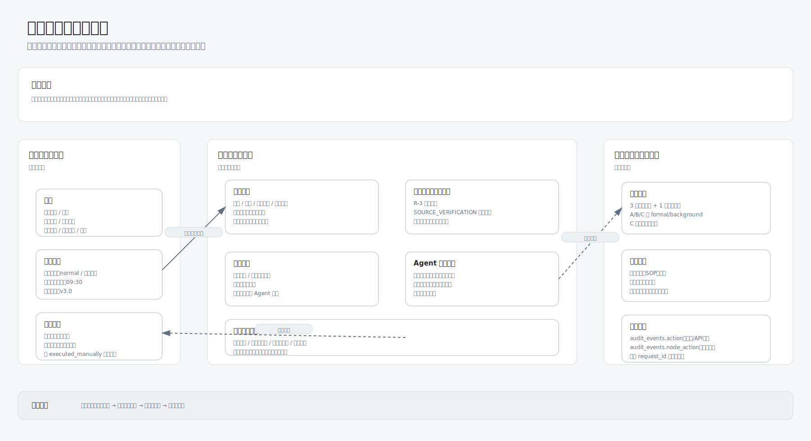
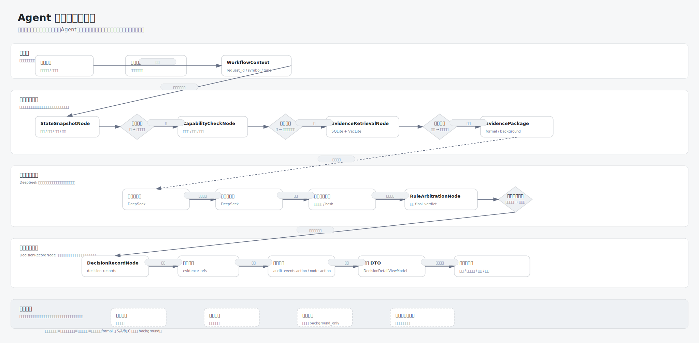
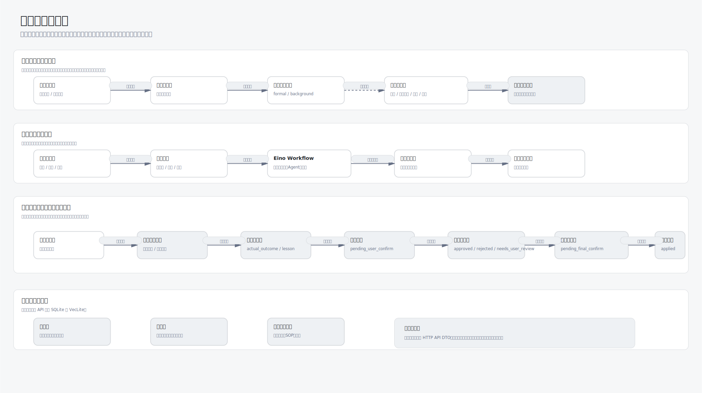

# Investment Agent UI 流程审计稿

> 文档版本：v1.0  
> 最后更新：2026-05-25  
> 适用范围：用于审查 UI 功能、页面流转、决策结果展示是否符合 Investment Agent 的纪律、证据和审计原则。  
> 关联文档：`docs/ui-design.md`、`docs/frontend-contract.md`、`docs/api.md`、`docs/workflow.md`。

## 1. 审计目标

本稿用于在正式页面设计前先确认 4 件事：

- 用户每天进入系统后，能否快速看懂当前纪律状态和风险边界。
- 每条建议是否能看到规则、证据、Agent 观点和最终裁决。
- 用户确认流程是否只记录线下动作，不暗示系统可以自动交易。
- 复盘、错误标注、规则提案和守门人审计是否形成完整追踪链路。

本稿不定义视觉细节、颜色规范和组件尺寸。视觉规范以 `docs/ui-design.md` 为准。

## 2. 审计图清单

| 图 | 文件 | 审查重点 |
| --- | --- | --- |
| 主驾驶舱信息架构图 | `docs/diagrams/ui-cockpit-ia.svg` / `docs/diagrams/ui-cockpit-ia.png` | 首页是否风险优先、证据可见、确认入口清楚 |
| Agent 决策流程审计图 | `docs/diagrams/ui-agent-decision-flow.svg` / `docs/diagrams/ui-agent-decision-flow.png` | 建议是否经过状态、证据、Agent、规则和记录 |
| 页面流转审计图 | `docs/diagrams/ui-page-flow.svg` / `docs/diagrams/ui-page-flow.png` | 页面之间是否能支撑查看、确认、复盘和审计 |

## 3. 主驾驶舱信息架构

### 3.1 页面定位

主驾驶舱是系统默认入口，不是聊天页，也不是行情页。

它必须优先回答：

1. 今天是否可以行动。
2. 是否触发纪律红线。
3. 系统为什么给出这个裁决。
4. 用户接下来只能做哪些记录动作。

### 3.2 三栏结构

| 区域 | 内容 | 审计问题 |
| --- | --- | --- |
| 左侧导航与状态 | 一级导航、账户状态、数据更新时间、规则版本、系统状态 | 用户是否知道当前数据是否有效 |
| 中间裁决工作区 | 纪律状态、触发规则、最终裁决、Agent 观点、用户确认区 | 用户是否能先看到风险和禁止项 |
| 右侧证据与规则面板 | 证据摘要、规则命中、账户快照、审计状态 | 用户是否能追踪裁决依据 |

### 3.3 首屏固定信息

首屏必须展示：

- 当前纪律状态。
- 触发红线与禁止事项。
- 今日建议或暂停原因。
- 账户与持仓摘要。
- 证据摘要或信息不足提示。
- 用户确认入口。

首屏不得把收益预期、聊天输入框、行情涨跌榜放在风险和纪律之前。

## 4. Agent 决策流程

### 4.1 标准链路

标准建议生成链路为：

1. 用户咨询或定时任务触发。
2. `StateSnapshotNode` 读取账户、持仓、行情和规则版本。
3. 系统检查数据是否完整。
4. `CapabilityCheckNode` 判断是否在能力圈内。
5. `EvidenceRetrievalNode` 从 SQLite 和 VecLite 获取证据。
6. 系统检查信源等级和多源验证状态。
7. 价值分析师和趋势风控官分别输出观点。
8. `RuleArbitrationNode` 按根本规则和裁决优先级给出最终裁决。
9. `DecisionRecordNode` 保存证据、规则、快照和审计事件。
10. 前端展示结构化裁决报告。
11. 用户只能记录计划、已手动执行、待观察或标记错误。

### 4.2 审计要点

| 节点 | 页面必须展示 | 不允许 |
| --- | --- | --- |
| 数据快照 | 快照时间、数据更新时间、规则版本 | 用过期数据生成交易类建议 |
| 证据检索 | 信源数量、信源等级、多源验证状态 | 单信源重大信息触发交易类建议 |
| Agent 观点 | 结论、关键理由、风险提醒、引用证据 | 把 Agent 观点当最终裁决 |
| 规则裁决 | 命中规则、禁止事项、最终建议 | 省略规则直接展示结论 |
| 决策记录 | 建议编号、生成时间、账户快照、审计事件 | 无记录地展示正式建议 |
| 用户确认 | 记录计划、已手动执行、待观察、标记错误 | 自动买入、一键卖出、代为执行 |

### 4.3 状态分支

| 状态 | 触发条件 | UI 结果 |
| --- | --- | --- |
| 首次使用 | 账户或持仓未录入 | 引导录入账户、持仓和能力圈 |
| 信息不足 | 行情过期、证据为空、索引不可用且摘要不足 | 暂停交易类建议，展示缺失项 |
| 冻结观察 | 多源验证不满足或突发事件待核查 | 暂停主动操作，展示等待条件 |
| 高危 | 逻辑破坏、规则缺失、记录失败 | 显示禁止事项，不展示正式建议 |
| 正常 | 数据完整且无高危规则 | 展示完整裁决报告和确认入口 |

## 5. 页面流转

### 5.1 页面地图

| 页面 | 主要用途 | 关键入口 |
| --- | --- | --- |
| 今日纪律页 | 默认首页，展示每日纪律状态和建议 | 查看详情、查看证据、记录确认 |
| 持仓页 | 管理账户、持仓、成本和买入逻辑 | 更新持仓、查看状态机 |
| 决策咨询页 | 用户主动提出问题并生成裁决报告 | 生成决策详情 |
| 决策详情页 | 展示单条建议的完整链路 | 查看证据、记录确认、标记错误 |
| 情报与证据页 | 查看信源、摘要、VecLite 命中块和多源验证 | 返回决策详情 |
| 复盘与审计页 | 查看历史建议、操作日志、错误案例和审计日志 | 进入规则提案审批 |
| 规则与纪律页 | 查看根本规则、SOP、阈值和规则提案 | 确认提案进入守门人审计 |
| 设置页 | 配置能力圈、仓位上限、现金比例、数据源 | 影响后续工作流输入 |

### 5.2 关键流转

#### 每日查看

1. 进入今日纪律页。
2. 查看纪律状态、红线、今日建议。
3. 展开证据摘要和规则命中。
4. 进入决策详情查看完整链路。
5. 若涉及动作，只能记录计划或已手动执行。

#### 主动咨询

1. 进入决策咨询页。
2. 输入问题和标的。
3. 系统执行 ConsultationGraph。
4. 进入决策详情页查看裁决报告。
5. 用户查看证据和规则后自行决定线下动作。
6. 用户回到确认区记录结果。

#### 错误标注与进化

1. 在决策详情或复盘与审计页选择历史建议。
2. 标记错误，填写实际结果、错误原因和经验记录。
3. 系统写入错误案例库。
4. 进化提案引擎定期生成规则优化提案。
5. 用户确认提案后进入守门人审计。
6. 守门人审计通过后，提案进入 `pending_final_confirm`。
7. 用户最终确认后写入 `rule_versions`，状态变为 `applied`，并生成 `audit_events`。

## 6. 决策结果展示结构

单条决策详情必须按以下顺序展示：

1. 最终裁决：建议动作、禁止事项、是否需要用户确认。
2. 建议摘要：编号、生成时间、当前状态。
3. 触发规则：根本规则、SOP、阈值、优先级。
4. 账户快照：现金比例、仓位比例、持仓状态。
5. 证据链：信源等级、摘要、发布时间、时效权重、hash。
6. Agent 观点：价值分析师、趋势风控官、信息核查结果。
7. 裁决链：从证据到规则裁决的过程。
8. 用户确认区：记录计划、已手动执行、待观察、标记错误。
9. 审计事件：节点状态、错误码、输入输出引用。

## 7. 用户确认流程

| 用户动作 | 是否更新账户 | 是否进入审计 | UI 文案边界 |
| --- | --- | --- | --- |
| 记录计划 | 否 | 是 | 只记录计划，不改变账户 |
| 已手动执行 | 是 | 是 | 仅记录用户已在线下完成的交易 |
| 标记待观察 | 否 | 是 | 暂不确认结果，后续继续跟踪 |
| 标记错误 | 否 | 是 | 写入错误案例库，用于复盘和提案 |

确认区不得出现：

- 立即买入。
- 一键卖出。
- 自动跟随。
- 代为执行。

## 8. 审计检查清单

用于你审查 UI 功能和结果是否合理：

### 8.1 首页审计

- 是否先展示纪律状态，而不是收益或聊天输入框。
- 是否能在首屏看到风险红线和禁止事项。
- 是否能看到数据更新时间和规则版本。
- 证据不足时是否明确显示缺失项。
- 是否没有自动交易入口。

### 8.2 决策详情审计

- 是否能看到最终裁决和禁止事项。
- 是否能看到触发规则和裁决优先级。
- 是否能看到证据链和信源等级。
- 是否能看到 Agent 观点，但不会把它当最终裁决。
- 是否能看到账户快照和建议编号。

### 8.3 用户确认审计

- 是否区分“记录计划”和“已手动执行”。
- 已手动执行是否要求填写操作类型、标的、数量、价格和时间。
- 标记错误是否要求填写实际结果、错误原因和经验记录。
- 是否所有确认动作都写入审计日志。

### 8.4 复盘与规则提案审计

- 错误案例是否能关联原建议、证据和规则版本。
- 规则提案是否展示变更前后内容。
- 守门人审计是否展示通过、否决、需要用户复核。
- 规则应用是否必须经过 `pending_final_confirm` 与用户最终确认，并生成 `audit_events`。

## 9. 当前设计判断

当前 UI 流程整体合理，原因如下：

- 首页围绕纪律状态、风险和裁决组织，不会引导用户高频交易。
- 决策详情能追踪数据、证据、Agent 观点、规则和用户确认。
- 用户动作被限定为记录与确认，不触发自动交易。
- 错误标注能进入规则提案和守门人审计，支撑受控进化。

需要在后续页面设计稿中继续细化：

- 每个页面的空状态、错误状态和加载状态。
- 决策详情页的信息密度和展开层级。
- 证据链详情的可读性。
- 审计日志时间线的展示方式。
- 移动端确认流程。
