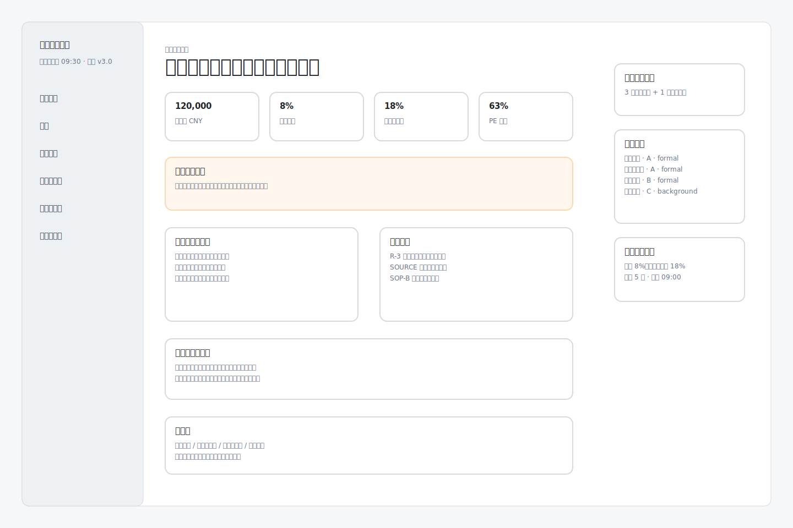
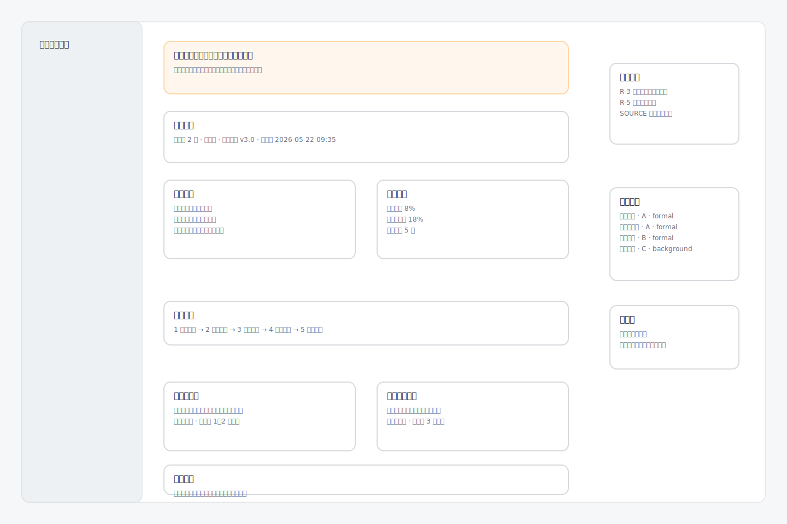

# Investment Agent UI 原型结论

> 版本：v0.1  
> 更新时间：2026-05-25  
> 关联文档：`docs/ui-design.md`、`docs/ui-flow.md`、`docs/frontend-contract.md`、`docs/workflow.md`

## 1. 原型定位

本原型用于确认 Investment Agent 的产品界面方向。它不是正式前端代码，也不替代 `web/src/pages/*` 的实现。

当前设计方向确定为：**冷静、克制、可审计的投资纪律工作台**。

界面核心不是聊天窗口，也不是行情交易终端，而是 Agent 决策驾驶舱。用户每天先看到纪律状态、动作边界、触发规则、证据依据和确认入口。

## 2. 已确认的产品结构

一级导航保留 7 个入口：

- 今日纪律
- 持仓
- 决策咨询
- 情报与证据
- 规则与纪律
- 复盘与审计
- 设置

其中“今日纪律”是主页面；其他页面是数据、证据、规则和审计支撑页面。

## 3. 关键页面截图

### 3.1 今日纪律驾驶舱

设计结论：

- 首屏只展示当前真实状态，不展示状态全集。
- 主信息顺序为：今日裁决、账户摘要、动作边界、触发规则、判断依据、用户确认。
- 按钮只记录用户线下动作，不提供自动交易入口。
- 右侧保留证据、账户快照和记录状态，服务于裁决可信度。

### 3.2 决策详情页

设计结论：

- 最终裁决放在顶部，优先于分析过程。
- 禁止事项和账户快照紧跟裁决，突出风险边界。
- 判断过程对应 Eino 工作流：账户快照、证据核查、分析观点、规则裁决、审计记录。
- 审计信息在详情页只展示摘要，完整日志进入“复盘与审计”。

## 4. 与架构和工作流的对应关系

| UI 区域 | 对应工作流 / 数据 |
| --- | --- |
| 今日纪律状态 | `DailyDisciplineGraph` 输出的纪律状态 |
| 账户摘要 | `StateSnapshotNode` / `portfolio_snapshot` |
| 触发规则 | `RuleArbitrationNode` / `triggered_rules` |
| 证据依据 | `EvidenceRetrievalNode` / `evidence_set` |
| 分析观点 | `ValueAnalystNode`、`TrendRiskOfficerNode` |
| 最终裁决 | `domain/rule` 规则裁决结果 |
| 用户确认 | `POST /api/v1/decisions/{decision_id}/confirmations` |
| 审计摘要 | `DecisionRecordNode` / `audit_events` |

## 5. 前端实现约束

- UI 展示必须使用用户能理解的中文文案，内部 ID、hash、向量信息默认折叠。
- 不把技术状态作为主文案，例如 `pending`、`in_scope`、`satisfied` 不直接展示。
- 不展示收益刺激、涨跌焦虑和交易诱导。
- 不出现自动交易入口。
- 主页面不放状态全集，只展示当前状态和允许动作。
- 证据、规则、审计页面用于支撑裁决，不抢占主体验。

## 6. 后续实现建议

前端实现时建议先完成以下页面：

1. 今日纪律驾驶舱
2. 决策详情页
3. 持仓页
4. 决策咨询页
5. 情报与证据页
6. 规则与纪律页
7. 复盘与审计页
8. 设置页

实现时以 `docs/frontend-contract.md` 为字段映射依据，以 `docs/ui-design.md` 为视觉与交互约束。
