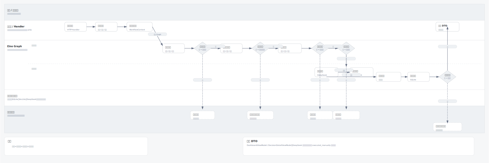

# Investment Agent Eino 工作流规范

> 文档版本：v1.1  
> 最后更新：2026-06-16  
> 适用范围：Eino Graph 编排、应用层用例编排、审计记录、前端展示链路。

## 1. 工作流定位

Investment Agent 由固定工作流驱动。大模型只作为分析节点的工具，不作为最终决策者。所有建议必须经过状态快照、信息核查、分析师观点、规则裁决、审计记录五类步骤。

核心原则：

- Eino Graph 负责节点编排和状态传递。
- `application/handler` 负责触发 Graph、保存结果、返回 DTO。
- `domain/rule` 负责最终规则裁决。
- `infrastructure/analyst` 和 `infrastructure/rag` 提供外部能力。
- 每次工作流执行必须生成可追溯的 `decision_records` 或 `audit_events`。

## 2. Graph 类型

### 2.1 Eino 执行流程图



说明：上图用于表达一次建议生成从前端触发、应用层组装上下文、Eino Graph 编排、领域规则裁决、记录保存到前端 DTO 返回的完整链路。每日纪律场景可使用已有配置执行能力圈相关约束；主动咨询场景必须经过能力圈检查。DeepSeek 只参与价值分析和趋势风控，不生成最终裁决；正式建议必须经过规则裁决和记录保存。

### 2.2 Graph 类型

| Graph | 触发入口 | 目标 | 输出 |
| --- | --- | --- | --- |
| DailyDisciplineGraph | 定时任务、驾驶舱刷新 | 生成每日纪律状态 | 今日纪律报告 |
| ConsultationGraph | 用户主动咨询 | 对标的或场景生成结构化裁决 | 决策报告 |
| EvidenceVerificationGraph | 情报刷新、咨询前置 | 获取、打标、验证信源 | 证据链 |
| EvolutionProposalGraph | 周期复盘、错误标注后 | 从错误案例生成规则提案 | 规则优化提案 |
| GatekeeperAuditGraph | 用户确认提案后 | 审计规则修改风险 | 审计结论 |

补充应用服务：`RuleEffectValidationService` 在规则提案送审、前端刷新验证和复盘汇总中聚合本地事实，生成规则效果验证与应用后追踪。它不是交易工作流，不创建订单、账户变更或正式规则版本。

## 3. Graph 装配原则

所有 Graph 按完整系统能力设计和装配。节点是否输出有效内容由输入数据、能力圈检查、信源完整度和外部服务可用性决定；模块交付顺序不改变 Graph 的完整能力定义。

| Graph | 必需节点 | 输出目标 |
| --- | --- | --- |
| DailyDisciplineGraph | StateSnapshotNode、EvidenceRetrievalNode、ValueAnalystNode、TrendRiskOfficerNode、ExpectedReturnNode、RuleArbitrationNode、DecisionRecordNode | 每日纪律状态、证据摘要、多 Agent 观点、预期收益情景和规则裁决 |
| ConsultationGraph | StateSnapshotNode、CapabilityCheckNode、EvidenceRetrievalNode、ValueAnalystNode、TrendRiskOfficerNode、ExpectedReturnNode、RuleArbitrationNode、DecisionRecordNode | 完整决策咨询、多 Agent 观点、预期收益情景与规则裁决 |
| EvidenceVerificationGraph | NewsFetchNode、NewsClassifyNode、EvidenceNormalizeNode、EmbeddingNode、VectorStoreNode、SourceVerificationNode | 证据链、信源等级和多源验证结果 |
| EvolutionProposalGraph | ErrorCaseAggregationNode、PatternSummaryNode、ProposalDraftNode、ProposalRecordNode | 规则优化提案 |
| GatekeeperAuditGraph | ProposalLoadNode、FundamentalRuleCheckNode、ConflictCheckNode、BacktestNode、AuditDecisionNode、AuditRecordNode | 审计结论 |

## 4. 统一执行上下文

所有 Graph 使用统一上下文结构，字段由应用层组装，节点只读取或追加必要内容。

```text
WorkflowContext
- request_id：本次执行唯一 ID
- workflow_type：daily_discipline / consultation / evidence_verification / evolution_proposal / gatekeeper_audit
- user_question：用户问题，可为空
- symbol：标的代码，可为空
- portfolio_snapshot：账户快照
- position_snapshots：持仓快照集合
- market_snapshot：市场状态快照
- rule_version：规则版本
- capability_status：能力圈检查结果，取值 in_scope / out_of_scope / unknown
- capability_reason：能力圈检查说明
- source_verification_status：多源验证状态，取值 satisfied / failed / background_only
- media_heat_summary：媒体热度摘要，包括新闻数量、情绪标签、来源等级和发布时间
- user_emotion_tags：用户文本情绪标签，例如 panic / euphoria / clear_position / full_position / chase_hotspot
- evidence_set：证据集合
- analyst_reports：多 Agent 分析报告集合
- expected_return_scenarios：预期收益情景集合，只作概率参考，必须持久化到 `decision_records.expected_return_scenarios_json`
- expected_return_sample_count：由真实 workflow 输入估算的可用样本数，包含匹配持仓成本、最新市场快照和 `market_metrics_json.metadata.nav_history` 条数，不得固定伪造为 20
- expected_return_sample_window：样本窗口说明
- expected_return_screening_condition：样本筛选条件
- expected_return_sell_evaluation：动态卖出评估材料，只提示人工复核，不执行交易
- expected_return_reassessment_trigger：重新评估触发原因、边界和当前值
- expected_return_previous_base_midpoint / expected_return_target_return_rate：可选动态卖出输入，由应用层显式提供；节点只生成提示，不自动交易
- rule_verdict：规则裁决结果
- rule_effect_validation：规则提案效果验证，包含来源解释、样本代表性、过拟合风险、历史回放和门禁结论
- rule_effect_tracking：已应用规则版本的复盘追踪，包含命中、误判、缺证据、降级、风险预警和趋势
- user_action_required：是否需要用户确认
- audit_events：审计事件列表
- errors：节点错误列表
```

## 5. 节点规范

所有节点必须遵守以下边界：

- 节点错误码必须对齐统一应用错误体系，并能映射到 HTTP status、审计 `error_code` 和前端展示状态。
- 节点需要生成决策、证据引用、审计或规则应用 ID 时，必须通过统一 ID 生成入口生成。
- 节点和审计事件写入时间必须使用统一 Clock，持久化为 UTC RFC3339 字符串。
- 工作流写持久化事实时必须调用仓储事务方法，不得在 Graph 中拆开同一事实单元。
- 支持类 Graph 的最终写入段必须把业务事实和对应 `audit_events` 放在同一个事务单元中：证据核查写入 `intelligence_items`、`intelligence_summary`、`rag_chunks`、`source_verifications`；市场刷新写入 `market_snapshots`；规则提案写入 `rule_proposals`；守门人审计写入 `gatekeeper_audits` 和提案状态。
- `public-evidence-refresh` 是显式本地任务入口，只有 `data_sources.public_evidence.enabled=true` 时才允许触发真实 collector；默认采集最近 90 天，也可通过 `--start-date YYYY-MM-DD --end-date YYYY-MM-DD` 指定显式日期窗口。成功采集必须通过 `PublicEvidenceIngestionService` 写入 `intelligence_items`、`intelligence_summary`、`rag_chunks`、`source_verifications` 和 `audit_events`，不得只停留在内存或日志。
- 公开证据 collector 的错误必须可诊断：`no_data` 表示源可达但标的/时间窗口内无记录，映射为 not found 类结果；全源均为 `no_data` 时，手动刷新应作为成功空刷新写入 `success count=0` 审计，并保留各源 `degraded` 诊断，不得误报为 `source_unavailable` 或任务失败；`source_unavailable` 表示 HTTP、DNS、状态码或公开入口不可用；`parse_error` 表示响应可达但字段 shape 与解析器不兼容。单源失败应保留 source-specific audit，多源组合不得把已满足的验证结果被后续单源降级覆盖。
- P29 真实 smoke 以显式私有配置和临时 SQLite 验证 CNInfo 公开公告可写入证据表；深交所或证监会当前公开入口无法稳定按标的返回数据时可作为降级背景源记录，不阻塞可用 A 级公开公告源入库。
- DailyDisciplineGraph 和 ConsultationGraph 的 DecisionRecordNode 必须把 `decision_records`、`evidence_refs` 和对应审计事件作为同一事务单元写入。

| 字段 | 要求 |
| --- | --- |
| Input | 只能读取表中列出的输入字段和上游节点输出。 |
| Output | 只能产出表中列出的输出字段。 |
| Mutates | 只能修改表中列出的 `WorkflowContext` 字段。 |
| Error | 必须返回结构化错误码，不得吞掉错误。 |
| Audit | 每个节点完成、降级或失败时都要追加 `audit_events` 草稿，由应用层统一写入。 |

### 5.1 StateSnapshotNode

职责：读取用户确认后的账户、持仓、行情、估值和规则版本。

输入：

- `request_id`
- `symbol`
- `workflow_type`

输出：

- `portfolio_snapshot`
- `position_snapshots`
- `market_snapshot`
- `rule_version`

失败处理：

- 账户未录入：返回 `DATA_REQUIRED`，前端进入首次使用状态。
- 行情缺失：返回 `DATA_STALE`，仅展示账户状态，不生成交易类建议。
- 规则版本缺失：返回 `RULE_VERSION_MISSING`，暂停裁决。

边界：

| 项 | 内容 |
| --- | --- |
| Input | `request_id`、`symbol`、`workflow_type` |
| Output | `portfolio_snapshot`、`position_snapshots`、`market_snapshot`、`rule_version` |
| Mutates | 只能写 `WorkflowContext.portfolio_snapshot`、`position_snapshots`、`market_snapshot`、`rule_version`、`errors` |
| Error | `DATA_REQUIRED` / `DATA_STALE` / `RULE_VERSION_MISSING` |
| Audit | `node_action=load_state_snapshot`，记录 snapshot_id、market_snapshot_id、rule_version 或错误码 |

### 5.2 CapabilityCheckNode

职责：判断用户询问的标的是否在能力圈内。

输入：

- `symbol`
- `user_question`
- 用户能力圈配置

输出：

- `capability_status`：in_scope / out_of_scope / unknown
- `capability_reason`

失败处理：

- out_of_scope：后续分析节点不执行，直接进入 RuleArbitrationNode 输出拒绝分析类裁决。
- unknown：允许继续信息核查，但最终建议必须降级为“仅供研究”。

边界：

| 项 | 内容 |
| --- | --- |
| Input | `symbol`、`user_question`、`capability_configs` |
| Output | `capability_status`、`capability_reason` |
| Mutates | 只能写 `WorkflowContext.capability_status`、`capability_reason`、`errors` |
| Error | 无配置时返回 `capability_status=unknown`；不得伪造 in_scope |
| Audit | `node_action=check_capability`，记录 status、reason |

### 5.3 EvidenceRetrievalNode

职责：从 SQLite 情报摘要和 VecLite 检索证据，按信源等级、时效权重和相关度返回证据链。

输入：

- `symbol`
- `user_question`
- `market_snapshot`

输出：

- `evidence_set`
- `source_verification_status`

失败处理：

- S/A/B 证据为空：返回 `EVIDENCE_NOT_FOUND`，只允许输出信息不足状态。
- 重大事件未满足多源验证：返回 `SOURCE_VERIFICATION_FAILED`，暂停交易类建议。
- VecLite 索引不可用且 SQLite 情报摘要充足：使用 SQLite 摘要降级展示，并标注 `VECTOR_INDEX_UNAVAILABLE`。
- VecLite 索引不可用且 SQLite 情报摘要不足：返回信息不足状态，不输出交易类建议。

边界：

| 项 | 内容 |
| --- | --- |
| Input | `symbol`、`user_question`、`market_snapshot`、`intelligence_summary`、`rag_chunks`、VecLite 检索结果 |
| Output | `evidence_set`、`source_verification_status` |
| Mutates | 只能写 `WorkflowContext.evidence_set`、`source_verification_status`、`errors` |
| Error | `EVIDENCE_NOT_FOUND` / `SOURCE_VERIFICATION_FAILED` / `VECTOR_INDEX_UNAVAILABLE` |
| Audit | `node_action=retrieve_evidence`，记录 evidence_count、verification_status、是否降级 |

### 5.4 ValueAnalystNode

职责：调用 DeepSeek，从估值、长期价值、安全边际和大师智慧角度生成独立报告。

输入：

- `portfolio_snapshot`
- `market_snapshot`
- `evidence_set`
- `rule_version`

输出：

- `analyst_report.value`
- `analyst_report_metadata.value`：`prompt_version`、`model`、`input_summary`、`output_summary`、`parse_status`、`quality_status`

约束：

- 不得输出确定性涨跌预测。
- 不得绕过信源验证给出买卖结论。
- 必须引用证据 ID 和规则 ID。

失败处理：

- LLM 调用失败：记录 `ANALYST_UNAVAILABLE`，并保留 missing_key、timeout、http_error、empty_response、parse_error、quality_failed、unavailable 等分类用于诊断；最终裁决降级为规则和数据驱动。

边界：

| 项 | 内容 |
| --- | --- |
| Input | `portfolio_snapshot`、`market_snapshot`、`evidence_set`、`rule_version` |
| Output | `analyst_report.value` |
| Mutates | 只能追加 `WorkflowContext.analyst_reports.value`、`WorkflowContext.analyst_report_metadata.value`、`errors` |
| Error | `ANALYST_UNAVAILABLE` |
| Audit | `node_action=run_value_analyst`，记录 analyst_status、引用 evidence_ids、prompt_version、model、parse_status、quality_status；不得记录明文 key |

### 5.5 TrendRiskOfficerNode

职责：调用 DeepSeek，从趋势、波动、仓位、流动性和组合风险角度生成独立报告。

输入：

- `portfolio_snapshot`
- `position_snapshots`
- `market_snapshot`
- `evidence_set`

输出：

- `analyst_report.trend_risk`
- `analyst_report_metadata.trend_risk`：`prompt_version`、`model`、`input_summary`、`output_summary`、`parse_status`、`quality_status`

约束：

- 风险提示优先于机会描述。
- 流动性不足时必须标注风险。
- 仓位超限时不得输出加仓倾向。

边界：

| 项 | 内容 |
| --- | --- |
| Input | `portfolio_snapshot`、`position_snapshots`、`market_snapshot`、`evidence_set` |
| Output | `analyst_report.trend_risk` |
| Mutates | 只能追加 `WorkflowContext.analyst_reports.trend_risk`、`WorkflowContext.analyst_report_metadata.trend_risk`、`errors` |
| Error | `ANALYST_UNAVAILABLE` |
| Audit | `node_action=run_trend_risk_officer`，记录 analyst_status、风险标签、prompt_version、model、parse_status、quality_status；不得记录明文 key |

### 5.6 ExpectedReturnNode

职责：基于当前本地持仓、最新市场快照、可用公开市场元数据和显式传入的历史类似样本上下文，生成上行、基准、下行情景收益区间，并输出动态卖出评估与重新评估触发材料。动态卖出评估按情景区间边界计算，例如进入 upside 下沿、突破 base 上沿、跌破 downside 下沿，而不是按单点收益率触发。预期收益节点只生成分析材料，不覆盖最终规则裁决，不创建交易、确认、通知或外部推送。

输入：

- `symbol`
- `market_snapshot`
- `portfolio_snapshot`
- `position_snapshots`
- 当前本地持仓、最新市场快照与可用公开市场元数据
- 显式传入的历史估值与行情样本上下文（若无则按样本不足处理）

输出：

- `expected_return_scenarios`
- `expected_return_sample_count`
- `expected_return_sample_window`
- `expected_return_screening_condition`
- `expected_return_sell_evaluation`
- `expected_return_reassessment_trigger`
- `analyst_report.expected_return` 与 `analyst_report_metadata.expected_return`（仅作为辅助分析材料）

失败处理：

- 历史类似样本 `>=20`：`precision_status=available`，可输出情景概率。
- 历史类似样本 `5~19`：`precision_status=insufficient`，不输出精确概率，只标记样本不足。
- 历史类似样本 `<5`：`precision_status=unavailable`，不生成收益区间，只输出定性风险提示。
- 市场快照缺失：返回 `DATA_STALE`，`precision_status=unavailable`，不得生成收益区间。

边界：

| 项 | 内容 |
| --- | --- |
| Input | `symbol`、`market_snapshot`、`portfolio_snapshot`、`position_snapshots`、历史估值与行情样本 |
| Output | `expected_return_scenarios`、`expected_return_sample_count`、`expected_return_sample_window`、`expected_return_screening_condition`、`expected_return_sell_evaluation`、`expected_return_reassessment_trigger` |
| Mutates | 只能写 `WorkflowContext.expected_return_scenarios`、`expected_return_sample_count`、`expected_return_sample_window`、`expected_return_screening_condition`、`expected_return_sell_evaluation`、`expected_return_reassessment_trigger`、`analyst_reports.expected_return`、`analyst_report_metadata.expected_return`、`errors` |
| Error | `DATA_STALE` / `INSUFFICIENT_SAMPLE` |
| Audit | `node_action=estimate_expected_return`，记录 sample_count、precision_status、prompt_version、model、parse_status、quality_status；不得记录明文 key |

### 5.7 RuleArbitrationNode

职责：调用 `domain/rule/rules_engine.go`，按根本规则和裁决优先级生成最终裁决。

输入：

- `portfolio_snapshot`
- `position_snapshots`
- `market_snapshot`
- `expected_return_scenarios`
- `evidence_set`
- `analyst_reports`
- `capability_status`

输出：

- `rule_verdict`
- `user_action_required`

裁决优先级：

1. 能力圈外：`final_verdict.status=rejected`，拒绝交易类分析。
2. 数据或有效证据不足：`final_verdict.status=insufficient_data`，暂停交易类建议。
3. 多源验证失败或重大事件证据不足：`final_verdict.status=frozen_watch`。
4. 买入逻辑破坏且证据满足正式裁决要求：`final_verdict.status=sell_only`。
5. 高危估值、现金不足或仓位超限：禁止新增买入。
6. 估值舒适区或低估区：只允许输出按计划定投、分批配置等可选动作。
7. 预期收益情景只作为分析材料，不得覆盖最终裁决。

确定性规则：

- 普通正式证据只允许 S/A/B 级信源；C 级信源只能作为 `background`。
- 重大利好、重大利空、买入逻辑破坏类事件，正式裁决必须满足至少 2 个 A 或 S 级独立信源；不满足时进入冻结观察。
- PE/PB 分位进入高危、观察、舒适、低估区间时，分别对应禁止新增买入、持有观察、按计划定投、分批配置建议。
- 现金比例低于 5% 时限制新增买入；5%-10% 不因现金规则单独禁止交易。
- 浮盈达到 20%、30%，或已启动移动止盈后从阶段高点回撤 10%，分别输出分批止盈或减仓/卖出评估动作。
- 核心资产目标区间为 60%-70%，卫星资产目标区间为 20%-30%；偏离 ±15% 或卫星资产超过上限时提示再平衡。

边界：

| 项 | 内容 |
| --- | --- |
| Input | `portfolio_snapshot`、`position_snapshots`、`market_snapshot`、`expected_return_scenarios`、`evidence_set`、`analyst_reports`、`capability_status`、`rule_version`、`errors` |
| Output | `rule_verdict`、`user_action_required` |
| Mutates | 只能写 `WorkflowContext.rule_verdict`、`user_action_required`、`errors` |
| Error | 上游错误映射为 `insufficient_data`、`frozen_watch`、`rejected` 或 `degraded` 裁决 |
| Audit | `node_action=arbitrate_rule`，记录 final_verdict.status、triggered_rules、prohibited_actions |

### 5.8 DecisionRecordNode

职责：保存决策记录、账户快照引用、证据引用、Agent 观点摘要、规则裁决结果。

输入：

- `WorkflowContext`

输出：

- `decision_id`
- `decision_record_status`

失败处理：

- 保存失败：返回 `DECISION_RECORD_FAILED`，前端不得展示为正式建议。

边界：

| 项 | 内容 |
| --- | --- |
| Input | 完整 `WorkflowContext`，必须包含 `rule_verdict`、`rule_version`、账户快照和证据引用 |
| Output | `decision_id`、`decision_record_status` |
| Mutates | 只能写 `WorkflowContext.decision_id`、`decision_record_status`、`audit_events`、`errors` |
| Error | `DECISION_RECORD_FAILED` |
| Audit | `node_action=record_decision`，与 `decision_records`、`evidence_refs` 在同一事务写入 |

### 5.9 EvolutionProposalNode

职责：读取错误案例库，生成规则优化提案。

输入：

- 错误案例集合
- 当前规则版本
- 用户行为标签

输出：

- `proposal_id`
- `proposal_type`
- `before_rule`
- `after_rule`
- `reason`
- `related_error_cases`

约束：

- 只生成提案，不直接修改规则。
- 样本少于 3 个时必须标记为样本不足，且不得进入最终应用路径。
- 规则提案状态机为：`draft` → `pending_user_confirm` → `under_gatekeeper_audit` → `pending_final_confirm` → `applied`。
- 用户放弃、守门人拒绝或最终拒绝时，提案进入 `rejected`。
- 守门人返回 `needs_user_review` 时，提案回到 `pending_user_confirm`。
- P36 效果验证必须把样本不足、来源过窄、过拟合高、历史回放不利和风险预警恶化作为门禁信号；缺失验证只能展示为 `not_evaluated`，不得假定安全。
- `applied` 与 `rejected` 为终态，重复操作必须返回错误，且不得创建新 active 规则版本。

边界：

| 项 | 内容 |
| --- | --- |
| Input | 错误案例集合、当前规则版本、用户行为标签 |
| Output | `proposal_id`、`proposal_type`、`before_rule`、`after_rule`、`reason`、`related_error_cases` |
| Mutates | 只能写规则提案相关上下文字段，不得修改 `rule_version` |
| Error | 样本不足时仍可生成提案，但必须标记风险；数据缺失时返回 degraded |
| Audit | `node_action=create_rule_proposal`，记录 sample_count、proposal_id |

### 5.10 RuleEffectValidationService

职责：聚合规则提案、错误案例、决策记录、确认结果、复盘摘要、风险预警和审计事件，生成本地规则效果验证和应用后追踪事实。

输入：

- `proposal_id`
- 候选规则版本
- 样本窗口
- 本地错误案例、决策、确认、复盘、风险预警和审计事件

输出：

- `validation_status`：not_evaluated / insufficient / passed / failed / needs_more_samples / needs_user_review
- `sample_count`、`sample_window`、`representativeness_status`
- `overfit_risk`：low / medium / high
- `replay_result`：passed / failed / mixed / unknown
- `guardrail_decision`：passed / rejected / needs_user_review
- `source_explanation`、`metrics`、`risk_notes` 和相关本地事实 ID

约束：

- 样本不足、来源过窄、单样本调参、冲突结果、历史回放不利或风险预警恶化时，输出 `insufficient`、`failed`、`needs_more_samples` 或 `needs_user_review`，不得输出可最终应用结论。
- 验证通过也不能自动应用规则，只能作为守门人审计和用户最终确认的输入。
- 刷新验证只能写 `rule_effect_validations` 和 `audit_events`，不得写 `rule_versions`、账户、持仓、确认、订单、券商或外部推送事实。
- 应用后追踪只能写 `rule_effect_tracking` 和 `audit_events`，不得自动回滚、替换或生成 active 规则版本。

边界：

| 项 | 内容 |
| --- | --- |
| Input | 规则提案、本地错误案例、决策记录、确认结果、复盘、风险预警和审计事件 |
| Output | `rule_effect_validations`、`rule_effect_tracking`、相关审计事件 |
| Mutates | 只能写规则效果验证/追踪事实和审计事件 |
| Error | 样本不足时输出 insufficient / needs_more_samples；缺事实时输出 not_evaluated 或 degraded，不伪造通过 |
| Audit | `node_action=run_rule_effect_validation` 或本地任务审计，记录 proposal_id、validation_id、tracking_id |

### 5.11 GatekeeperAuditNode

职责：审计规则提案是否违反根本规则、是否过拟合、是否降低历史表现。

输入：

- `proposal_id`
- `before_rule`
- `after_rule`
- 历史回测数据

输出：

- `audit_result`：approved / rejected / needs_user_review
- `audit_reason`
- `required_changes`

约束：

- 审计通过后仍需用户最终确认。
- 审计否决不得写入正式规则。
- `needs_user_review` 时提案回到 `pending_user_confirm`，等待用户修改、放弃或重新送审。
- 守门人必须消费 P36 效果验证结果；样本不足、代表性不足、过拟合高、历史回放不利或验证版本不匹配时，必须拒绝或返回 `needs_user_review`。
- 仅当提案状态为 `pending_final_confirm`、用户最终确认且 `sample_count>=3` 时，才允许创建新 active 规则版本。
- 最终确认时若 `sample_count<3`，必须返回错误，提案状态保持不变，不写入正式规则版本。

边界：

| 项 | 内容 |
| --- | --- |
| Input | `proposal_id`、`before_rule`、`after_rule`、历史回测数据、当前 active rule_version |
| Output | `audit_result`、`audit_reason`、`required_changes`、`allow_apply` |
| Mutates | 只能写审计结论和提案状态，不得写 `rule_versions` |
| Error | 审计执行失败时保持提案原状态，并写 `audit_events.status=failed` |
| Audit | `node_action=audit_rule_change`，记录 audit_result、allow_apply、proposal_id |

## 6. DailyDisciplineGraph

执行顺序：

```text
StateSnapshotNode
  -> EvidenceRetrievalNode
  -> ValueAnalystNode
  -> TrendRiskOfficerNode
  -> ExpectedReturnNode
  -> RuleArbitrationNode
  -> DecisionRecordNode
```

节点按完整链路装配。节点因数据缺失、能力圈外、信源验证失败或外部服务不可用而无法产生有效结果时，必须写入错误码和审计事件，并由 RuleArbitrationNode 按降级规则输出裁决。前端依据返回字段和错误码展示证据摘要、Agent 观点或信息不足状态。

输出必须包含：

- 今日纪律状态。
- 触发规则。
- 禁止事项。
- 账户和持仓摘要。
- 最终裁决。
- 用户确认入口。
- Agent 观点摘要。
- 预期收益情景摘要。
- 证据摘要。

降级规则：

- 账户未录入：输出首次使用状态。
- 数据过期：输出信息不足状态。
- 证据不足：不输出交易类建议。

报告索引规则：

- DailyDisciplineGraph 由本地手动任务触发时，系统 SHALL 将结果写入 `daily_discipline_reports`，`source_type=manual`，`source_id` 为本次 request id。
- P31 每日自动运行触发 DailyDisciplineGraph 时，系统 SHALL 将自动运行结果写入同一报告索引，`source_type=auto_run`，`source_id` 为每日自动运行幂等键。
- 同一 `local_date + scope + symbol_set_hash` 的重复聚合 SHALL 复用或更新同一报告索引，避免冲突的同日报告。
- 报告状态 SHALL 映射为 not_started / running / success / degraded / failed / insufficient_data，并保留失败或缺前提诊断。
- `decision_records` 仍是正式裁决事实源；每日纪律报告只作为本地只读阅读、追踪和历史回看入口。
- 报告聚合不得调用券商接口、创建订单请求、标记操作已执行、承诺收益或预测确定涨跌。
- 当账户快照或当前持仓缺失时，Dashboard 与每日纪律报告 SHALL 展示缺前提状态并引导到 `/positions` 完成本地账户/持仓 onboarding；在缺前提满足前不得生成伪正式建议或伪 `decision_records`。

风险预警接入规则：

- DailyDisciplineGraph 或其应用层报告聚合完成后，系统 SHALL 调用风险预警编排，传入 `decision_id`、`report_id`、`request_id`、市场快照和 P34 source health 上下文。
- 风险预警编排 SHALL 根据估值高位、买入逻辑破坏、流动性危险、情绪极端、仓位超限、证据不足和数据降级生成或更新本地 `risk_alerts`。
- active / escalated 风险 SHALL 写入本地 `notifications` 并关联 `audit_events`；重复 active 风险按 risk type + symbol 去重。
- 每日纪律报告 DTO SHALL 展示 triggered / active / observing / escalated 风险摘要，包括 SOP 状态、禁止动作、建议人工动作和风险详情链接。
- 风险预警编排不得创建交易、订单、券商状态、操作确认、外部推送、规则版本或收益承诺。

## 7. ConsultationGraph

执行顺序：

```text
StateSnapshotNode
  -> CapabilityCheckNode
  -> EvidenceRetrievalNode
  -> ValueAnalystNode
  -> TrendRiskOfficerNode
  -> ExpectedReturnNode
  -> RuleArbitrationNode
  -> DecisionRecordNode
```

输出必须包含：

- 用户问题。
- 能力圈检查结果。
- 信息核查结果。
- 价值分析师观点。
- 趋势与风控官观点。
- 预期收益情景。
- 规则裁决。
- 证据链。
- 用户确认状态。

## 8. MarketRefreshGraph

定位：市场刷新是独立 Eino Graph，由 `POST /api/v1/market/refresh` 或本地任务触发；DailyDisciplineGraph 与 ConsultationGraph 只读取最新 `market_snapshots`，不在决策链中直接拉取外部行情。

执行顺序：

```text
MarketSourceFetchNode
  -> MarketNormalizeNode
  -> MarketSnapshotRecordNode
```

输出必须包含：

- 成功写入的 `market_snapshot_id` 列表。
- 失败标的列表。
- 数据源状态。
- 审计事件 ID。

节点边界：

| 节点 | 职责 | 写入 |
| --- | --- | --- |
| MarketSourceFetchNode | 读取已配置数据源，拉取行情、估值、流动性和情绪指标 | 只写 WorkflowContext 临时市场数据 |
| MarketNormalizeNode | 标准化指标，生成 `liquidity_state=normal/warning/danger`、`sentiment_state=cold/neutral/hot/extreme` | 只写标准化市场快照草稿 |
| MarketSnapshotRecordNode | 写入 `market_snapshots` 和 `audit_events` | `market_snapshots`、`audit_events` |

部分成功审计规则：至少 1 个标的成功写入且存在失败标的时，接口返回 200，`audit_events.status=degraded`，`output_ref` 记录成功的 `market_snapshot_id`，失败标的和原因写入 `output_ref` 或审计详情；全部成功时 `audit_events.status=success`；全部失败或写入失败时 `audit_events.status=failed`。

错误处理：

| 错误码 | 场景 | 处理 |
| --- | --- | --- |
| DATA_SOURCE_UNAVAILABLE | 数据源不可用 | 返回刷新失败，不生成交易类建议 |
| DATA_STALE | 数据存在但过期 | 页面展示信息不足 |
| MARKET_SNAPSHOT_WRITE_FAILED | 快照写入失败 | 事务回滚并写失败审计事件 |

## 9. EvidenceVerificationGraph

执行顺序：

```text
NewsFetchNode
  -> NewsClassifyNode
  -> EvidenceNormalizeNode
  -> EmbeddingNode
  -> VectorStoreNode
  -> SourceVerificationNode
```

输出必须包含：

- 情报 ID。
- 信源等级。
- 发布时间。
- 摘要。
- 内容 hash。
- VecLite 向量 ID。
- 多源验证状态。

## 10. EvolutionProposalGraph

执行顺序：

```text
ErrorCaseAggregationNode
  -> PatternSummaryNode
  -> ProposalDraftNode
  -> ProposalRecordNode
```

输出必须包含：

- 提案 ID。
- 提案类型。
- 关联错误案例。
- 变更前规则。
- 变更后规则。
- 样本数量。
- 风险提示。

## 11. GatekeeperAuditGraph

执行顺序：

```text
ProposalLoadNode
  -> FundamentalRuleCheckNode
  -> ConflictCheckNode
  -> BacktestNode
  -> AuditDecisionNode
  -> AuditRecordNode
```

输出必须包含：

- 审计结果。
- 审计理由。
- 是否违反根本规则。
- 是否存在规则冲突。
- 回测指标变化。
- 是否允许写入正式规则。

## 12. 审计事件规范

审计事件由统一审计契约生成。`action` 表示业务动作，`node_name` 表示 Graph 或节点名称，`node_action` 表示节点内部动作；输入和输出必须通过 `input_ref_type/input_ref`、`output_ref_type/output_ref` 指向可追踪对象。失败和降级事件必须包含统一 `error_code`。

| 字段 | 说明 |
| --- | --- |
| audit_event_id | 审计事件 ID，对应 API 响应中的 `event_id` |
| request_id | 工作流执行 ID |
| workflow_type | 工作流类型 |
| node_name | 节点名称 |
| actor | 操作者，取值为 system / user / gatekeeper |
| action | 业务动作，例如 generate_decision、confirm_operation、audit_rule_change |
| node_action | 节点动作，例如 load_state_snapshot、retrieve_evidence、verify_source、run_value_analyst、run_trend_risk_officer、estimate_expected_return、arbitrate_rule、record_decision、audit_rule_change、degrade_workflow |
| status | success / degraded / failed |
| before_state | 操作前状态，可为空 |
| after_state | 操作后状态，可为空 |
| rule_version | 执行时规则版本 |
| snapshot_id | 关联账户快照 ID，可为空 |
| input_ref | 输入摘要或引用 ID |
| output_ref | 输出摘要或引用 ID |
| error_code | 错误码，可为空 |
| created_at | 事件时间 |

## 13. 情绪指标输入来源

情绪极端判定由规则引擎基于结构化指标和文本标签共同计算，不能只依赖大模型判断。

| 输入来源 | 数据字段 | 用途 |
| --- | --- | --- |
| 市场交易数据 | 成交量、换手率、波动率、涨跌幅、融资余额变化 | 识别市场过热、恐慌和异常波动 |
| 媒体热度统计 | 同一实体相关新闻数量、标题情绪标签、来源等级、发布时间 | 识别媒体高频报道和情绪共振 |
| 用户文本标签 | 用户咨询中的恐慌、狂喜、清仓、满仓、追热点等表达标签 | 识别用户当下行为风险 |
| 历史分位数据 | 成交量分位、融资余额变化分位、波动率分位 | 将当前情绪指标转为可审计阈值 |

处理规则：

- 情绪指标进入 `market_snapshot`。
- 用户文本标签进入 `WorkflowContext.user_emotion_tags`。
- 媒体热度统计进入 `WorkflowContext.media_heat_summary`，可由 `evidence_set` 聚合生成，最终写入 `decision_records.media_heat_summary_json`。
- RuleArbitrationNode 统一读取这些字段并判定是否触发冷静机制。

## 14. P74 LLM 知识与数据准备度上下文

Consultation 和每日纪律相关 analyst 调用必须构造 `KnowledgeContextSummary`，用于把内置知识、估值/证据/规则准备度和安全边界以脱敏摘要传给 LLM。

约束：

- 摘要只能包含稳定 knowledge ID、依赖状态和边界说明，不包含完整 prompt、密钥、私有路径、raw HTTP 或供应商原始 payload。
- 摘要不得把大师经验、纪律规则、风险 SOP 或 C/background 材料提升为正式证据。
- LLM analyst output 仍只能写入 `analyst_reports`，最终裁决继续由规则裁决链生成。
- `active_rule` 缺失、正式证据不足、估值分位缺失或未知标的画像时，工作流必须保持安全降级或阻断，不得用 LLM 文本补足。
- 决策详情可展示“LLM 已参考知识与数据准备度摘要”和 prompt version，但不得展示完整 prompt 或 `data_readiness=` 原文。

## 15. 错误与降级策略

| 错误码 | 场景 | 前端状态 | 处理 |
| --- | --- | --- | --- |
| DATA_REQUIRED | 账户或持仓未录入 | 首次使用 | 不生成正式建议，写审计事件 |
| DATA_SOURCE_UNAVAILABLE | 市场或行情数据源不可用 | 信息不足 | 不输出交易类建议 |
| DATA_STALE | 行情或估值过期 | 信息不足 | 交易类建议暂停，`market_snapshot_id` 可为空 |
| EVIDENCE_NOT_FOUND | 无有效证据 | 信息不足 | 不输出交易类建议 |
| SOURCE_VERIFICATION_FAILED | 多源验证未满足 | 冻结观察 | 暂停交易类建议，可展示证据核查状态 |
| VECTOR_INDEX_UNAVAILABLE | VecLite 索引不可用 | 视 SQLite 摘要完整度决定降级或信息不足 | SQLite 摘要充足时 `workflow_status=degraded` 且可展示建议；摘要不足时不输出交易类建议 |
| ANALYST_UNAVAILABLE | LLM 分析不可用 | 可降级展示 | `workflow_status=degraded`，使用规则裁决降级输出，可保存正式建议 |
| RULE_VERSION_MISSING | 规则版本缺失 | 高危 | 暂停裁决，不保存正式建议 |
| MARKET_SNAPSHOT_WRITE_FAILED | 市场快照写入失败 | 高危 | 事务回滚并写失败审计事件，不展示正式建议 |
| DECISION_RECORD_FAILED | 决策记录保存失败 | 高危 | 不展示正式建议 |

## 16. P4 HTTP API 工作流边界

P4 HTTP API 必须暴露工作流支撑的行为，但不得改变 P3 工作流语义。

约束：

- `POST /api/v1/decisions/consult` 必须同步执行 `ConsultationGraph`，返回可渲染的决策详情，并保持“规则优先”约束：DeepSeek 分析材料不得写最终裁决。
- `POST /api/v1/evidence/refresh` 在 SQLite 事实写入成功后，如果向量索引更新失败，不得回滚已写入的 SQLite 事实数据；响应必须通过稳定字段或错误状态表达索引失败。
- 规则提案通过守门人审计后，只能进入或暴露 `pending_final_confirm`，不得在最终确认前创建新的 active `rule_versions`。

## 17. 与其他文档关系

- API 契约见 `docs/api.md`。
- 前端字段映射见 `docs/frontend-contract.md`。
- UI 展示顺序见 `docs/ui-design.md`。
- 规则和业务边界见 `docs/requirements.md`。
- 技术分层和目录规范见 `docs/architecture.md`。
